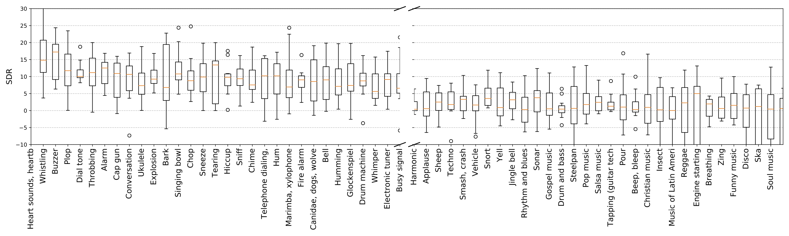

# AudioSet source separation

This codebase provide a system to separate 527 kinds of sound classes in AudioSet. The code base is implemented with PyTorch 1.1. 

## Download 
## 1. Download dataset
Users need to download the balanced and evaluation subset from AudioSet and pack them to hdf5 file. Please follow Qiuqiang's audio_tagging source code bash file to download the balanced and evaluation subset and pack them to hdf5 file.  
<pre>

(AudioSet is already downloaded to /mnt/cephfs_new_wj/speechsv/qiuqiang.kong/datasets/audioset, a copy of packed  waveform can be found here: /mnt/cephfs_new_wj/speechsv/qiuqiang.kong/workspaces/pub_audioset_tagging_cnn_transfer/hdf5s)

dataset_root
├── audios
│    ├── balanced_train_segments
│    |    └── ... (~20550 wavs, the number can be different because some links are missing)
│    └── eval_segments
│         └── ... (~18887 wavs)
└── metadata
     ├── balanced_train_segments.csv
     ├── class_labels_indices.csv
     └── eval_segments.csv
</pre>

## 2. Pack data to hdf5. The reason of packing waveforms is to avoid too many small files and speed up loading

<pre>
workspace
└── hdf5s
     ├── targets (2.3 GB)
     |    ├── balanced_train.h5
     |    └── eval.h5
     └── waveforms
          ├── balanced_train.h5
          └── eval.h5
</pre>

## Run
Running is simple. Please follow runme.sh, which includes training and validation. 

## Results
The CNN models are trained on a single card Tesla-V100-PCIE-32GB. After 7 day training, users may get the following result:

```
Parameters num: 18971075
Validate bal sdr: -2.980, sir: inf, sar: -2.980
Validate test sdr: -3.117, sir: inf, sar: -3.117
    Dump statistics to /mnt/cephfs_new_wj/speechsv/qiuqiang.kong/workspaces/pub_audioset_tagging_cnn_transfer/statistics/ss_main/data_type=balanced_train/UNet/condition_type=soft_hard/wiener_filter=False/loss_type=mae/batch_size=12/statistics.pkl
    Dump statistics to /mnt/cephfs_new_wj/speechsv/qiuqiang.kong/workspaces/pub_audioset_tagging_cnn_transfer/statistics/ss_main/data_type=balanced_train/UNet/condition_type=soft_hard/wiener_filter=False/loss_type=mae/batch_size=12/statistics_2019-09-22_09-43-45.pickle
    iteration: 0, train time: 0.975 s, validate time: 200.526 s
------------------------------------
...
------------------------------------
    Validate bal sdr: 4.791, sir: inf, sar: 4.791
    Validate test sdr: 6.629, sir: inf, sar: 6.629
    Dump statistics to /mnt/cephfs_new_wj/speechsv/qiuqiang.kong/workspaces/pub_audioset_tagging_cnn_transfer/statistics/ss_main/data_type=balanced_train/UNet/condition_type=soft_hard/wiener_filter=False/loss_type=mae/batch_size=12/statistics.pkl
    Dump statistics to /mnt/cephfs_new_wj/speechsv/qiuqiang.kong/workspaces/pub_audioset_tagging_cnn_transfer/statistics/ss_main/data_type=balanced_train/UNet/condition_type=soft_hard/wiener_filter=False/loss_type=mae/batch_size=12/statistics_2019-09-22_09-43-45.pickle
    iteration: 500000, train time: 1280.718 s, validate time: 147.981 s
------------------------------------
...
```

The SDRs of source separation result of AudioSet as shown below sorted in descending:

