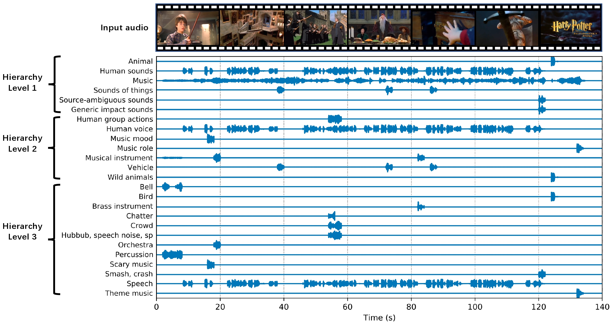

# Universal Source Separation (USS) with Weakly labelled Data

This is the PyTorch implementation of the Universal Source Separation with Weakly labelled Data [1]. The USS system can automatically detect and separate sound classes from a real recording. The USS system can separate up to hundreds of sound classes sound classes in a hierarchical ontology structure. The USS system is trained on the weakly labelled AudioSet dataset only. Here is a demo:


Fig. The hierarchical separation result of the trailer of *Harry Potter and the Sorcerer's Stone*. Copyright: [https://www.youtube.com/watch?v=VyHV0BRtdxo](https://www.youtube.com/watch?v=VyHV0BRtdxo)

## 1. Installation

Prepare environment (optional)
```bash
conda create -n uss python=3.8
conda activate uss
```

Install the package
```bash
pip install uss
```

## 2. Separate Your Favorite Audio

### 2.1 Download test audio (optional)
```bash
wget -O "harry_potter.flac" "https://huggingface.co/RSNuts/Universal_Source_Separation/resolve/main/uss_material/harry_potter.flac"
```

### 2.2 Detect and separate sound classes in hierarchical levels (default)
```bash
uss -i "harry_potter.flac"
```

### 2.3 The same as default
```bash
uss -i "harry_potter.flac" --levels 1 2 3
```

### 2.4 Separate by class IDs
```bash
uss -i "harry_potter.flac" --class_ids 0 1 2 3 4
```

### 2.5 Separate by queries

Download query audios (optional)

```bash
wget -O "queries.zip" "https://huggingface.co/RSNuts/Universal_Source_Separation/resolve/main/uss_material/queries.zip"
unzip queries.zip
```

Do separation 

```bash
uss -i "harry_potter.flac" --queries_dir "queries/speech"
```

## 3. Git Clone the Repo and do Inference

Users could also git clone this repo and run the inference in the repo. This will let users to have more flexibility to modify the inference code.

### 3.1 Set up environment

```bash
conda create -n uss python=3.8
conda activate uss
pip install -r requirements.txt
```

### 3.2 Inference

Download our pretrained checkpoint: 

```bash
wget -O "pretrained.ckpt" "https://huggingface.co/RSNuts/Universal_Source_Separation/resolve/main/uss_material/ss_model%3Dresunet30%2Cquerynet%3Dat_soft%2Cdata%3Dfull%2Cdevices%3D8%2Cstep%3D1000000.ckpt"
```

Then perform the inference:

```python
CUDA_VISIBLE_DEVICES=0 python uss/inference.py \
    --audio_path=./resources/harry_potter.flac \
    --levels 1 2 3 \
    --config_yaml="./scripts/train/ss_model=resunet30,querynet=at_soft,data=full.yaml" \
    --checkpoint_path="pretrained.ckpt"
```

## 4. Train the USS system from scratch

### 4.0 Download dataset

Download the AudioSet dataset from the internet. The total size of AudioSet is around 1.1 TB. For reproducibility, our downloaded dataset can be accessed at: link: [https://pan.baidu.com/s/13WnzI1XDSvqXZQTS-Kqujg](https://pan.baidu.com/s/13WnzI1XDSvqXZQTS-Kqujg), password: 0vc2. Users may only download the balanced set (10.36 Gb, 1% of the full set) to train a baseline system.

The downloaded data looks like:

<pre>

audioset
├── audios
│    ├── balanced_train_segments
│    |    └── ... (~20550 wavs, the number can be different from time to time)
│    ├── eval_segments
│    |    └── ... (~18887 wavs)
│    └── unbalanced_train_segments
│         ├── unbalanced_train_segments_part00
│         |    └── ... (~46940 wavs)
│         ...
│         └── unbalanced_train_segments_part40
│              └── ... (~39137 wavs)
└── metadata
     ├── balanced_train_segments.csv
     ├── class_labels_indices.csv
     ├── eval_segments.csv
     ├── qa_true_counts.csv
     └── unbalanced_train_segments.csv
</pre>

Notice there can be missing files on YouTube, so the numebr of files downloaded by users can be different from time to time. Our downloaded version contains 20550 / 22160 of the balaned training subset, 1913637 / 2041789 of the unbalanced training subset, and 18887 / 20371 of the evaluation subset. 

### 4.1 Pack waveforms into hdf5 files

Audio files in a subdirectory will be packed into an hdf5 file. There will be 1 balanced train + 41 unbalanced train + 1 evaluation hdf5 files in total.

```bash
bash scripts/1_create_train_data/1_pack_waveforms_to_hdf5s.sh
```

The packed hdf5 files looks like:

<pre>
workspaces/uss
└── hdf5s
     └── waveforms (1.1 TB)
          ├── balanced_train.h5
          ├── eval.h5
          └── unbalanced_train
              ├── unbalanced_train_part00.h5
              ...
              └── unbalanced_train_part40.h5
</pre>

### 4.2 Create indexes for balanced training

Pack indexes into hdf5 files for balanced training.

```bash
bash scripts/1_create_train_data/2_create_indexes.sh
```

The packed indexes files look like:

<pre>
workspaces/uss
└── hdf5s
     └── indexes (3.0 GB)
          ├── balanced_train.h5
          ├── eval.h5
          └── unbalanced_train
              ├── unbalanced_train_part00.h5
              ...
              └── unbalanced_train_part40.h5
</pre>

### 4.3 Create evaluation data

Create 100 2-second mixture and source pairs to evaluate the separation result of each sound class. There are in total 52,700 2-second pairs for 527 sound classes.

```bash
bash scripts/2_create_evaluation_data/audioset.sh
```

The evaluation data look like:
<pre>
workspaces/uss
└── evaluation
     └── audioset
          ├── 2s_segments_balanced_train.csv
          ├── 2s_segments_test.csv
          ├── 2s_segments_balanced_train
          │   ├── class_id=0
          │   │   └── ... (100 mixture + 100 clean)
          │   │...
          │   └── class_id=526
          │       └── ... (100 mixture + 100 clean)
          └── 2s_segments_test
              ├── class_id=0
              │   └── ... (100 mixture + 100 clean)
              │...
              └── class_id=526
                  └── ... (100 mixture + 100 clean)
</pre>

### 4.4 Train

Train the universal source separation system.

```bash
bash scripts/3_train.sh
```

Or simply execute:

```bash
WORKSPACE="workspaces/uss"
CUDA_VISIBLE_DEVICES=0 python uss/train.py \
    --workspace=$WORKSPACE \
    --config_yaml="./scripts/train/ss_model=resunet30,querynet=at_soft,data=balanced.yaml"
```

### 5 Evaluation

We provide data to evaluate the USS system on AudioSet, FSDKaggle2018, FSD50k, Slakh2100, MUSDB18, and Voicebank-Demand datasets.

5.0 Data processing

**Users can skip this stage** and directly download the processed evaluation data listed in the table below.

In case the users wish to know more details of the evaluation data creation, please run the following scripts.

```bash
bash scripts/2_create_evaluation_data/fsdkaggle2018.sh
bash scripts/2_create_evaluation_data/fsd50k.sh
bash scripts/2_create_evaluation_data/slakh2100.sh
````

| Dataset          | Type    | Sound classes | Duration (hours) | Download |
|------------------|---------|---------------|------------------|----------|
| AudioSet         | Audio   | 527           | 29.3             |          |
| FSDKaggle2018    | Audio   | 41            | 2.3              |          |
| FSD50k           | Audio   | 195           | 10.8             |          |
| Slakh2100        | Music   |               |                  |          |
| MUSDB18          | Music   | 4             |                  | https://zenodo.org/record/3338373 |
| Voicebank-Demand | Speech  | 1             |                  | https://datashare.ed.ac.uk/handle/10283/1942?show=full |

## 5.1 Calculate the query embeddings of datasets. 

Users may run the following script line by line.

```bash
bash scripts/5_evaluate/1_calculate_query_embeddings.sh
```

## 5.2 Separate and evaluate on datasets.

Users may run the following script line by line.

```bash
bash scripts/5_evaluate/2_separate_and_evaluate.sh
```

## Citation

[paper link](https://arxiv.org/pdf/2305.07447.pdf)

<pre>
@article{kong2023universal,
  title={Universal Source Separation with Weakly Labelled Data},
  author={Kong, Qiuqiang and Chen, Ke and Liu, Haohe and Du, Xingjian and Berg-Kirkpatrick, Taylor and Dubnov, Shlomo and Plumbley, Mark D},
  journal={arXiv preprint arXiv:2305.07447},
  year={2023}
}
</pre>

## FAQ

If from uss.config import CLASSES_NUM occur, then execute:

```bash
PYTHONPATH=`pwd`
export PYTHONPATH
```